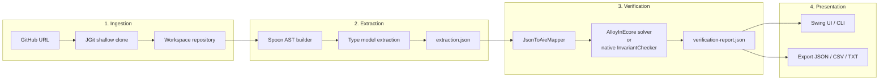
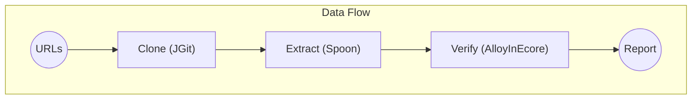
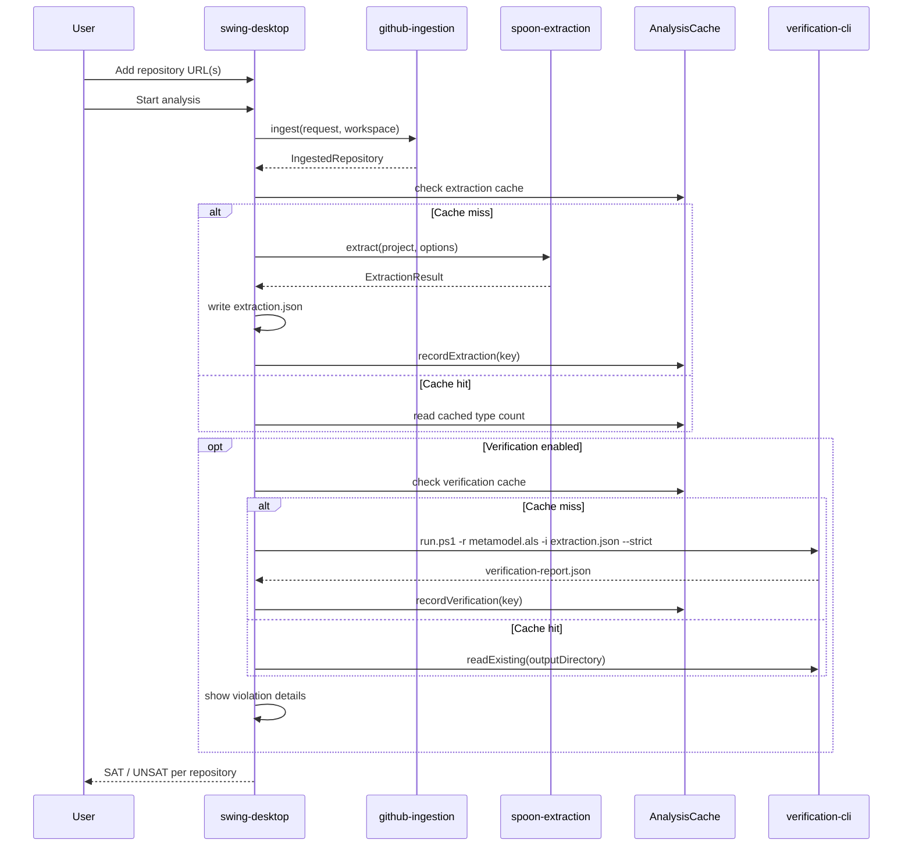

# Java Analysis Pipeline

A modular, extensible platform for large-scale structural analysis of Java repositories. Designed for academic researchers and software engineering practitioners who need to clone, extract, verify, and explore the structural properties of Java codebases at scale.

---

## Table of Contents

- [Overview](#overview)
- [Architecture](#architecture)
  - [High-Level Pipeline Design](#high-level-pipeline-design)
  - [Module Dependency Graph](#module-dependency-graph)
  - [Pipeline Workflow](#pipeline-workflow)
- [Modules](#modules)
  - [analysis-core](#analysis-core)
  - [github-ingestion](#github-ingestion)
  - [github-search](#github-search)
  - [spoon-extraction](#spoon-extraction)
  - [verification-cli (standalone)](#verification-cli-standalone)
  - [verification-integration](#verification-integration)
  - [swing-desktop](#swing-desktop)
- [Formal Verification with Alloy](#formal-verification-with-alloy)
  - [Class-Level Structural Kernel](#class-level-structural-kernel)
  - [Invariant Checks](#invariant-checks)
- [Getting Started](#getting-started)
  - [Prerequisites](#prerequisites)
  - [Build](#build)
  - [Run the Desktop Application](#run-the-desktop-application)
  - [Run the Verification CLI](#run-the-verification-cli)
- [Output Format](#output-format)
- [Caching and Incremental Execution](#caching-and-incremental-execution)
- [Related Projects](#related-projects)
- [License](#license)

---

## Overview

The **Java Analysis Pipeline** automates the end-to-end workflow of ingesting Java repositories from GitHub, extracting structural type models using the [Spoon](https://fr.inria.fr/gforge/spoon/) static analysis framework, and verifying those models against formal structural invariants expressed in [Alloy](https://alloytools.org/).

The pipeline supports three modes of operation:

1. **Batch analysis** — Queue multiple GitHub repository URLs, then clone, extract, and verify them in one run.
2. **GitHub search integration** — Search repositories by keywords, language, owner, stars, forks, license, and topic, then add results directly to the analysis queue.
3. **Existing repository verification** — Re-verify already-extracted repositories without re-cloning or re-extracting, using cached extraction JSON files.

The verification step checks for common structural anti-patterns: cyclic inheritance, duplicate type names, interface field declarations, static abstract methods, and local method namespace collisions — all formalised in a declarative Alloy model and checked either through the AlloyInEcore toolchain or through equivalent native Java invariant checks.

---

## Architecture

The platform follows a **modular, interface-driven** design. The `analysis-core` module defines all domain contracts; downstream modules implement them, and the desktop application composes them.

### High-Level Pipeline Design

The pipeline transforms a set of GitHub repository URLs into a structured verification report through four sequential stages:



**Stage 1 — Ingestion:** Each repository URL is resolved to a `RepositoryRequest` and cloned via JGit (shallow, configurable depth). Existing clones are reused when the `REUSE` policy is active. Progress is reported through `ProgressEvent` callbacks.

**Stage 2 — Extraction:** The cloned source tree is scanned for Java source roots. Spoon builds a full AST model, which is then walked to produce a flat structural type model: types, fields, executables, and inheritance relationships. The result is serialised as `extraction.json`.

**Stage 3 — Verification:** The extraction JSON is mapped to an AlloyInEcore instance (`.aie` format) representing the concrete model. Two verification paths are available: (a) the AlloyInEcore framework translates structural invariants from the Alloy metamodel into Kodkod SAT problems and solves them; (b) the native `InvariantChecker` mirrors the same invariants directly in Java for deterministic, solver-free checking. Both paths produce the same JSON report.

**Stage 4 — Presentation:** The desktop application displays results in a sortable table grouped by repository and invariant. Results can be exported as JSON, CSV, or plain text. The CLI offers a lightweight headless alternative.



### Module Dependency Graph

```mermaid
flowchart TB
    subgraph Core["analysis-core (interfaces & domain types)"]
        direction TB
        RI[RepositoryIngestionService]
        JE[JavaExtractionService / getLanguage()]
        GS[GitHubRepositorySearchService]
        PE[ProgressEvent / CancellationToken]
        LG[Language enum: JAVA, PYTHON, CPP]
    end

    subgraph Impl["Service Implementations"]
        GI[github-ingestion<br/>JGit shallow clone]
        GSvc[github-search<br/>GitHub REST API + Gson]
        SE[spoon-extraction<br/>Spoon AST → JSON model]
        PE[python-extraction<br/>stdlib ast → JSON model]
    end

    subgraph Verify["Verification"]
        VI[verification-integration<br/>subprocess orchestrator]
        CLI[verification-cli<br/>standalone verifier]
        ALS[kernel_v2_obligation.als<br/>Alloy formal model]
    end

    subgraph UI["Desktop Application"]
        AF[swing-desktop<br/>AnalysisFrame + Swing workers]
    end

    Core --> GI
    Core --> GSvc
    Core --> SE
    Core --> VI
    VI --> CLI
    CLI --> ALS
    GI --> AF
    GSvc --> AF
    SE --> AF
    VI --> AF
```

### Pipeline Workflow



---

## Modules

### analysis-core

**Coordinates:** `com.javapipeline:analysis-core:0.2.0-SNAPSHOT`

The backbone of the platform. Defines all domain interfaces and records with zero external dependencies:

| Type | Purpose |
|---|---|
| `RepositoryIngestionService` | Contract for cloning/pulling Git repositories |
| `JavaExtractionService` | Contract for extracting structural models from source |
| `GitHubRepositorySearchService` | Contract for searching GitHub repositories |
| `RepositoryRequest` / `IngestedRepository` | Ingestion input/output records |
| `ExtractionResult` (with `TypeModel`, `FieldModel`, `ExecutableModel`, `ParameterModel`) | Structural type model |
| `ProgressListener` / `CancellationToken` | Cross-cutting async support |
| `GitHubSearchCriteria` / `GitHubRepositorySummary` / `GitHubSearchResponse` | Search domain types |
| `ExtractionOptions` | Compliance level, test inclusion |

### github-ingestion

**Coordinates:** `com.javapipeline:github-ingestion:0.2.0-SNAPSHOT`

Implements `RepositoryIngestionService` using **JGit** (Eclipse JGit v7.1.0). Performs shallow clones of GitHub repositories into a configurable workspace directory. Supports `REUSE` (reuse existing clone), `REPLACE` (re-clone), and `FAIL` (abort if exists) policies. Reports clone progress via the `ProgressListener` callback.

### github-search

**Coordinates:** `com.javapipeline:github-search:0.2.0-SNAPSHOT`

Implements `GitHubRepositorySearchService` against the **GitHub REST API** (`/search/repositories`). Supports the full GitHub search query syntax: keywords, primary language, owner/org, topic, license, star/fork/size ranges, creation/push dates, fork and archive mode filters, and multiple sort orders. Handles pagination, rate-limit tracking, and token-based authentication.

### spoon-extraction

**Coordinates:** `com.javapipeline:spoon-extraction:0.2.0-SNAPSHOT`

Implements `JavaExtractionService` using **Spoon** (v11.3.0). Builds a full Spoon model from discovered Java source roots, then walks the AST to produce a flat type model with:

- Fully qualified type names and their `kind` (class, interface, enum, annotation, record)
- Fields: name, type reference, visibility, static flag
- Executables (methods/constructors): name, parameter types, return type, visibility, static flag, abstract flag
- Inheritance relationships (superclass and implemented interfaces)
- Source line numbers

The output is serialized to JSON via `ExtractionJsonWriter`.

### verification-cli (standalone)

**Coordinates:** `com.verification:standalone-verifier:1.0-SNAPSHOT`

A standalone Maven project (not part of the reactor) that performs structural verification. It uses a hybrid approach:

1. **AlloyInEcore** (Eclipse-based model verification framework, bundled as pre-built JARs in `lib/`) — translates the extraction JSON into an AIE instance and runs it through the Alloy/Kodkod solver.
2. **Native Java invariant checker** (`InvariantChecker`) — mirrors the Alloy model's structural `fact` constraints directly in Java, bypassing the Kodkod solver. This ensures consistent results without solver latency.

Accepts both `.recore` (legacy) and `.als` (native Alloy) metamodel files. See the [Formal Verification with Alloy](#formal-verification-with-alloy) section for the full list of invariants.

### verification-integration

**Coordinates:** `com.javapipeline:verification-integration:0.2.0-SNAPSHOT`

Orchestrates the `verification-cli` as a subprocess. Handles subprocess lifecycle, 15-minute safety timeout, cancellation propagation, and parsing of JSON/CSV reports. Also provides `readExisting()` for loading cached verification results without re-running the solver.

### swing-desktop

**Coordinates:** `com.javapipeline:swing-desktop:0.2.0-SNAPSHOT`

A Swing-based graphical user interface that composes all platform services. Packaged as a shaded uber-JAR via `maven-shade-plugin`. Key features:

- **Repository queue** — URL input, GitHub search dialog, start/cancel/remove/clear
- **Configuration panel** — workspace path, output path, verifier path, metamodel path, clone depth, Java compliance level, test inclusion, verification toggle, clone reuse
- **Activity log** — real-time streaming log output
- **Verification results table** — per-repository, per-violation rows with constraint name, line, and description
- **Export** — verification results as JSON, CSV, or plain text
- **File > Load existing repositories** — scans the output directory for previously analyzed repos and loads their cached results
- **Right-click context menu** — run single repo, show details, open output folder, view verification results
- **Path validation** — inline red/green feedback when path fields lose focus
- **GitHub search dialog** — modal dialog with 14 search criteria, paginated table, rate-limit tracking, presistable search preferences
- **Window close guard** — confirmation dialog when a worker is active
- **Preferences persistence** — workspace, output, verifier, metamodel, verify toggle, include tests, reuse toggle, and GitHub search parameters survive restart

---

## Formal Verification with Alloy

### Class-Level Structural Kernel

The verification metamodel is defined in [`modules/verification-cli/src/main/resources/kernel_v2_obligation.als`](modules/verification-cli/src/main/resources/kernel_v2_obligation.als). This is an Alloy formal model that captures the essential structural elements of object-oriented classifiers (classes and interfaces), organized around 10 formal obligations (O-01 through O-09), with accompanying verification commands in [`verification_v2.als`](modules/verification-cli/src/main/resources/verification_v2.als).

The model defines:

- **Signatures:** `Class`, `Method`, `Attribute`, `Object`, `Visibility`, `Scope`, `ClassifierKind`, `MethodBody`
- **Relations:** Inheritance (`parents`), membership (`attributes`, `methods`, `iattributes`, `imethods`), typing (`rtype`, `atype`), and scoping
- **Facts:** 15 structural invariants formalised as Alloy `fact` constraints

### Invariant Checks

The platform verifies the following structural properties:

| Invariant | Description | Alloy fact |
|---|---|---|
| `IdentifierIntegrity` | No duplicate type names within the same package; IDs are unique and cover their domain | ✓ |
| `AcyclicGeneralization` | Inheritance hierarchy contains no cycles | ✓ |
| `GeneralizationKindPolicy` | Classes extend classes; interfaces extend interfaces | ✓ |
| `LocalMethodNamespace` | No two methods in the same class share the same name | ✓ |
| `InterfacePolicy` | Interfaces declare no fields; interface methods are abstract | ✓ |
| `StaticMethodPolicy` | Static methods cannot be abstract | ✓ |
| `AbstractionPolicy` | Classes with unresolved abstract methods must be declared abstract | ✓ |
| `ExclusiveDeclarationOwnership` | Each method and attribute belongs to exactly one declaring class | ✓ |
| `NoUnresolvedInheritedMethodConflict` | No conflicting method signatures from multiple inherited interfaces | ✓ |
| `AbstractMethodHasNoDeclaringBody` | Abstract methods must not have a method body | ✓ |

A result of **SAT** means the extracted model satisfies all invariants; **UNSAT** means one or more violations were detected. The verification report lists each violated invariant together with the specific elements involved.

---

## Getting Started

### Prerequisites

- **Java Development Kit** — JDK 17 or later (tested with JDK 21). The system default JDK on Windows is often JDK 8; the scripts auto-detect JDK 17+ under `C:\Program Files\Java\`.
- **Apache Maven** — 3.9+ (used by all build scripts; must be on `PATH`).

### Build

```bash
# Windows
.\build.ps1

# Linux / macOS
./build.sh

# Or manually
mvn clean verify
```

This compiles all reactor modules, runs unit tests, and packages the desktop application as a shaded uber-JAR. The `verification-cli` module is built separately within its own directory — see its [README](modules/verification-cli/README.md) for details.

> **Note:** The three JARs built by the deleted `alloy-in-ecore-java-verification/` subproject are pre-committed in `modules/verification-cli/lib/`. No additional source build is needed for those dependencies.

### Run the Desktop Application

```bash
# Windows
.\run-desktop.ps1

# Linux / macOS
./run-desktop.sh

# Or directly
java -jar apps/swing-desktop/target/swing-desktop-*-all.jar
```

The desktop application starts with a default workspace path (`workspace/repositories`) and output path (`analysis-output/`). You can change these in the UI or via Preferences persistence.

### Run the Pipeline CLI (clone → extract → verify)

```bash
# Windows
.\pipeline.ps1 --repo https://github.com/user/repo

# Linux / macOS
./pipeline.sh --repo https://github.com/user/repo
```

**Options:**

| Flag | Description | Default |
|---|---|---|
| `-r, --repo <url>` | GitHub repository URL | *(required)* |
| `-l, --language <lang>` | `java`, `python`, or `cpp` | auto-detected |
| `-o, --output <dir>` | Analysis output directory | `analysis-output` |
| `-w, --workspace <dir>` | Clone workspace | `workspace/repositories` |
| `-m, --metamodel <file>` | Alloy .als metamodel path | `modules/verification-cli/.../kernel_v2_obligation.als` |
| `-v, --verifier <dir>` | Verification modules directory | `modules/verification-cli` |
| `-d, --depth <n>` | Clone depth | `1` |
| `--no-verify` | Skip structural verification | *(verification enabled)* |
| `-h, --help` | Show usage help | |

**Exit codes:** `0` = SAT, `1` = UNSAT, `2` = ERROR

**Examples:**

```bash
# Java project (auto-detected)
.\pipeline.ps1 --repo https://github.com/iluwatar/java-design-patterns

# Python project (explicit language)
.\pipeline.ps1 --repo https://github.com/psf/requests --language python

# Fast extraction only, skip verification
.\pipeline.ps1 --repo https://github.com/user/lib --no-verify -o results/

# Custom output and workspace paths
.\pipeline.ps1 --repo https://github.com/user/repo -o ./my-output -w ./my-workspace -d 3
```

### Run the Verification CLI (standalone)

```bash
# Windows
cd modules/verification-cli
.\run.ps1 -r src/main/resources/kernel_v2_obligation.als -i path/to/extraction.json -o output

# Linux / macOS
cd modules/verification-cli
./run.sh -r src/main/resources/kernel_v2_obligation.als -i path/to/extraction.json -o output
```

---

## Output Format

### Extraction JSON (`extraction.json`)

```json
{
  "name": "owner__repo",
  "types": [
    {
      "qualifiedName": "com.example.Foo",
      "kind": "CLASS",
      "superClass": "com.example.Bar",
      "interfaces": ["java.io.Serializable"],
      "fields": [
        {
          "name": "value",
          "type": "int",
          "visibility": "PRIVATE",
          "static": false
        }
      ],
      "executables": [
        {
          "name": "compute",
          "parameters": ["java.lang.String"],
          "returnType": "int",
          "visibility": "PUBLIC",
          "static": false,
          "abstract": false
        }
      ],
      "abstractType": false
    }
  ]
}
```

### Verification Report JSON (`verification-report.json`)

```json
{
  "result": "UNSAT",
  "violations": [
    {
      "invariantName": "InterfacePolicy",
      "description": "Interface ConfigCollection has field log"
    }
  ]
}
```

### Verification Report CSV (`verification-report.csv`)

Exported from the desktop application as:

```
Repository,Result,Constraint,Line,Description
```

---

## Caching and Incremental Execution

The platform implements two levels of caching to avoid redundant work during iterative research workflows:

1. **Extraction cache** — Fingerprints the repository revision, Java compliance level, test inclusion flag, and the full content of every `.java` source file (SHA-256). Reusing an exact match skips both the clone and Spoon model-building steps.
2. **Verification cache** — Combines the extraction fingerprint with the full content of the metamodel file. Reusing a match skips the Alloy solver entirely.

Cache data is stored in `analysis-cache.properties` files inside each output directory. Cache entries are invalidated automatically when the source code, options, or metamodel change.

---

## Related Projects

This platform integrates and builds upon the following open-source projects:

| Project | Usage | Version |
|---|---|---|
| [Spoon](https://github.com/INRIA/spoon) | Java source code analysis and AST model building | 11.3.0 |
| [Alloy](https://alloytools.org/) | Declarative formal specification language for the metamodel | — |
| [AlloyInEcore](https://github.com/Epsilon-Forge/AlloyInEcore) | Model verification framework translating structural invariants into Alloy/Kodkod SAT problems | 1.0-SNAPSHOT |
| [Eclipse JGit](https://www.eclipse.org/jgit/) | Pure Java Git implementation for cloning/pulling repositories | 7.1.0 |
| [Gson](https://github.com/google/gson) | JSON serialization/deserialization | 2.11.0 |
| [Kodkod](https://github.com/emina/kodkod) | SAT-based finite model finder used by Alloy | 2.3 |
| [Z3](https://github.com/Z3Prover/z3) | SMT solver from Microsoft Research | 4.6.0 |
| [SAT4J](https://sat4j.org/) | SAT solver library for Java | 2.3.1 |
| [ANTLR](https://www.antlr.org/) | Parser generator used by AlloyInEcore's constraint grammar | 4.7 |
| [Eclipse Modeling Framework (EMF)](https://eclipse.dev/modeling/emf/) | Metamodel representation framework used by AlloyInEcore | — |
| [EMF Compare](https://eclipse.dev/emf/compare/) | Model comparison library used by AlloyInEcore | — |
| [SLF4J](https://www.slf4j.org/) | Simple logging facade for Java | 2.0.16 |

---

## License

This project is licensed under the MIT License. See the [LICENSE](LICENSE) file for details.
